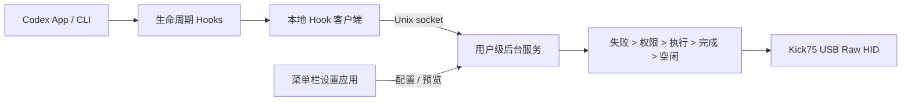

# Codex Kick75 Status Lights

[](https://github.com/zzm20011015/codex-kick75-status-lights/actions/workflows/ci.yml)
[](LICENSE)

把 OpenAI Codex App 与 Codex CLI 的全局任务状态映射到 NuPhy Kick75 IO 的 5 颗侧灯。

`0.2.0` 提供用户级后台服务和原生 macOS 菜单栏设置应用。四种任务状态可以分别设置 RGB 与亮度，
配置保存后立即生效，也可以在保存前预览 3 秒。

| 全局状态 | 默认侧灯 | 判定规则 |
| --- | --- | --- |
| 工具失败 | 红色 | 任一任务出现可识别的工具失败 |
| 权限等待 | 红色 | 没有工具失败，但至少一个任务等待权限 |
| 执行中 | 黄色 | 没有异常，且至少一个任务正在执行 |
| 全部完成 | 绿色 | 所有仍被跟踪的任务均已完成 |
| 空闲 | 原灯效 | 没有活跃任务，恢复接管前的侧灯配置 |

全局优先级为：

```text
工具失败 > 权限等待 > 执行中 > 全部完成 > 原灯效
```

完成状态默认保持 10 秒，然后自动恢复键盘原来的侧灯效果。

> [!IMPORTANT]
> 当前只验证了 macOS + NuPhy Kick75 IO（USB VID/PID `19f5:1026`）。任意 RGB 控制依赖 USB
> Raw HID，蓝牙连接无法使用本项目的灯光控制功能。

## 功能概览

- 汇总多个 Codex App 与 Codex CLI 任务，不会让并行任务互相覆盖状态。
- 使用一个用户级 LaunchAgent 串行访问键盘，避免多个 Hook 争用 USB HID。
- 自动保存并恢复接管前的侧灯效果。
- USB 重连或键盘复位灯效后，自动恢复当前任务状态色。
- 分别配置执行中、权限等待、工具失败、全部完成的颜色与亮度。
- 原生 macOS 菜单栏应用，支持系统取色器、十六进制输入、亮度滑块和 3 秒预览。
- 配置热加载，无需重启后台服务或 Codex。
- Hook 只传递事件名、任务 ID、轮次 ID 和失败布尔值，不传输提示词或工具正文。
- 不修改主键区灯效、键位、固件或键盘持久化配置。

## 部署要求

| 项目 | 要求 |
| --- | --- |
| 操作系统 | macOS；菜单栏应用要求 macOS 13 或更高版本 |
| 键盘 | NuPhy Kick75 IO，USB VID/PID `19f5:1026` |
| 连接方式 | 支持数据传输的 USB 线，不能只连接蓝牙 |
| Python | Python 3.9 或更高版本；可使用 macOS 自带的 `/usr/bin/python3` |
| 编译工具 | Xcode Command Line Tools，提供 `clang`、`swift` 和 `codesign` |
| Codex | 支持生命周期 Hooks 的 Codex App 或 Codex CLI |

检查编译环境：

```bash
clang --version
swift --version
```

如果命令不存在，安装 Command Line Tools：

```bash
xcode-select --install
```

## 全新安装

### 1. 下载项目

```bash
git clone https://github.com/zzm20011015/codex-kick75-status-lights.git
cd codex-kick75-status-lights
```

### 2. 先测试键盘连接

保持键盘通过 USB 连接，然后执行：

```bash
/usr/bin/python3 scripts/install.py test-hid
```

预期现象：5 颗侧灯变成绿色约 5 秒，随后恢复测试前的灯效。这个测试不会修改主键区灯效、键位或
固件。如果侧灯没有变化，请先查看[故障排查](#故障排查)，不要继续安装。

### 3. 安装后台服务与 Codex Hooks

```bash
/usr/bin/python3 scripts/install.py install
```

安装器会：

1. 使用 `clang` 编译 HID 控制器。
2. 创建 `~/Library/Application Support/CodexKick75/`。
3. 首次安装时创建 `settings.json`；升级时校验并保留已有配置。
4. 安装并启动用户级 LaunchAgent。
5. 把 5 个生命周期 Hook 合并到 `~/.codex/hooks.json`。
6. 在修改已有 `hooks.json` 前创建带时间戳的备份。

安装完成后检查状态：

```bash
/usr/bin/python3 scripts/install.py status
```

后台服务成功时会显示类似结果：

```text
service: running (version 0.2.0)
hooks:   5/5 installed
status:  idle
tasks:   0
hardware: unknown
settings: /Users/me/Library/Application Support/CodexKick75/settings.json
```

后台服务尚未接管灯光时，`hardware: unknown` 是正常状态。

### 4. 安装菜单栏应用

```bash
/usr/bin/python3 scripts/install.py install-app
```

该命令会编译、临时签名并安装：

```text
~/Applications/Codex Kick75.app
```

首次启动：

```bash
open "$HOME/Applications/Codex Kick75.app"
```

应用启动后，键盘图标会出现在系统菜单栏，不会显示在 Dock 中。应用当前不会自动设置为登录项；重启
Mac 后需要重新打开。退出应用可使用设置面板底部的“退出”按钮。

如果只需要生成 `.app`，不安装到用户目录：

```bash
/usr/bin/python3 scripts/install.py build-app
```

构建产物位于：

```text
build/Codex Kick75.app
```

### 5. 重新启动 Codex

使用 `Command + Q` 完全退出 Codex App，然后重新打开。只关闭窗口不会重新加载 Hooks。

在 Codex CLI 中可以运行：

```text
/hooks
```

以下事件应显示 `Installed 1` 和 `Active 1`：

- `UserPromptSubmit`
- `PermissionRequest`
- `PostToolUse`
- `Stop`
- `SessionEnd`

如果 Codex 要求审查 Hook，请确认命令指向：

```text
/Users/<用户名>/Library/Application Support/CodexKick75/codex_kick75_hook.py
```

### 6. 验证真实任务

在 Codex 中提交一个会持续数秒的任务，例如：

```text
请执行 sleep 8，完成后只回复“测试完成”
```

使用默认配置时，预期顺序为：

```text
黄色约 8 秒 → 绿色约 10 秒 → 恢复原灯效
```

## 从旧版本升级

进入项目目录并拉取最新代码：

```bash
git pull
```

重新安装后台服务和菜单栏应用：

```bash
/usr/bin/python3 scripts/install.py install
/usr/bin/python3 scripts/install.py install-app
```

升级会保留有效的 `settings.json`，更新运行文件、LaunchAgent 和菜单栏应用。已有 Codex Hooks 会先去重
再合并，不会重复追加；其他项目的 Hook 不会被删除。

升级完成后使用 `Command + Q` 退出并重新打开 Codex，然后检查：

```bash
/usr/bin/python3 scripts/install.py status
```

## 使用菜单栏应用

菜单栏面板包含四张状态卡片：执行中、等待权限、工具失败和已完成。

- 点击颜色控件使用 macOS 系统取色器。
- 也可以直接输入 `#RRGGBB`；非法格式会即时提示，并禁用预览和保存。
- 亮度范围为 `0%` 到 `100%`。
- “预览”会把未保存的颜色显示 3 秒，然后自动恢复。
- “保存并应用”会原子写入配置，并通知后台服务立即加载。
- “恢复默认”会恢复四种状态的默认值并保存。
- “重新读取”会丢弃面板中的未保存修改，重新读取磁盘配置。

预览要求后台服务正在运行，且键盘通过 USB 连接。保存配置不要求键盘在线；如果后台服务暂时不可用，
配置仍会保留，并在服务下次启动时加载。

## 使用命令行配置

查看当前配置：

```bash
/usr/bin/python3 scripts/install.py config
```

修改颜色和亮度：

```bash
/usr/bin/python3 scripts/install.py config \
  --state running \
  --color '#7C3AED' \
  --brightness 80

/usr/bin/python3 scripts/install.py config \
  --state permission \
  --color '#FF7A00'

/usr/bin/python3 scripts/install.py config \
  --state failure \
  --color '#FF0033'

/usr/bin/python3 scripts/install.py config \
  --state completed \
  --color '#00D084' \
  --brightness 60
```

| 状态参数 | 含义 | 默认值 |
| --- | --- | --- |
| `running` | 正在执行 | `#FFB400`，100% |
| `permission` | 等待权限 | `#FF0000`，100% |
| `failure` | 工具失败 | `#FF0000`，100% |
| `completed` | 全部完成 | `#00FF00`，100% |

颜色必须为 `#RRGGBB`，亮度必须是 `0` 到 `100` 的整数。

恢复默认配置：

```bash
/usr/bin/python3 scripts/install.py config --reset
```

配置文件位置：

```text
~/Library/Application Support/CodexKick75/settings.json
```

配置使用版本化 JSON 格式：

```json
{
  "version": 1,
  "states": {
    "running": {"color": "#FFB400", "brightness": 100},
    "permission": {"color": "#FF0000", "brightness": 100},
    "failure": {"color": "#FF0000", "brightness": 100},
    "completed": {"color": "#00FF00", "brightness": 100}
  }
}
```

非法配置不会覆盖后台服务内存中的最后一个有效版本。错误会写入日志，并显示在 `status` 和菜单栏应用中。

## 自定义运行参数

安装时可以调整完成状态保持时间、陈旧任务超时和 USB 重连检查间隔：

```bash
/usr/bin/python3 scripts/install.py install \
  --completed-hold 15 \
  --stale-task-hours 6 \
  --reconnect-check 10
```

| 参数 | 默认值 | 作用 |
| --- | --- | --- |
| `--completed-hold` | `10` 秒 | 全部完成后保持完成颜色的时间 |
| `--stale-task-hours` | `12` 小时 | 清理没有正常结束的陈旧任务 |
| `--reconnect-check` | `10` 秒 | 活跃状态下检查侧灯是否被 USB 重连复位 |

`--green-hold` 是 `--completed-hold` 的兼容别名。修改参数后会更新 LaunchAgent 并重启后台服务。

## 管理命令

所有管理操作通过同一个脚本完成：

```bash
/usr/bin/python3 scripts/install.py <command>
```

| 命令 | 作用 |
| --- | --- |
| `build` | 仅编译 HID 控制器 |
| `build-app` | 构建本机架构的菜单栏应用 |
| `install` | 安装或升级后台服务与 Hooks |
| `install-app` | 构建并安装菜单栏应用 |
| `status` | 查看服务、Hooks、任务、灯色、键盘与配置状态 |
| `config` | 查看或修改颜色与亮度 |
| `reset` | 清空跟踪任务并恢复接管前的侧灯效果 |
| `test-hid` | 执行可恢复的绿色 5 秒硬件测试 |
| `uninstall` | 移除服务、Hooks、运行文件和菜单栏应用 |

对应的 Make 命令：

```bash
make build
make build-app
make test
make test-app
make install
make install-app
make status
make config
make reset
make test-hid
make uninstall
```

## 运行文件

```text
~/Library/Application Support/CodexKick75/
├── codex_kick75_common.py
├── codex_kick75_daemon.py
├── codex_kick75_hook.py
├── kick75_ledctl
├── daemon.log
├── daemon.log.1
├── settings.json
├── state.json
└── status.sock
```

其他安装位置：

```text
~/Library/LaunchAgents/com.zzm.codex-kick75.plist
~/Applications/Codex Kick75.app
~/.codex/hooks.json
```

查看日志：

```bash
tail -f "$HOME/Library/Application Support/CodexKick75/daemon.log"
```

日志超过约 1 MiB 后轮换为 `daemon.log.1`。日志只记录聚合状态、任务数量和硬件错误，不记录提示词、
工具参数或工具输出正文。

## 故障排查

### `status` 显示服务未运行

重新执行安装：

```bash
/usr/bin/python3 scripts/install.py install
```

如果仍未启动，检查 LaunchAgent 日志：

```bash
tail -n 100 "$HOME/Library/Application Support/CodexKick75/daemon.log"
```

### `/hooks` 显示 `Active 0`

1. 确认项目目录已被 Codex 信任。
2. 确认 `~/.codex/hooks.json` 存在。
3. 在 `/hooks` 中审查并信任本项目 Hook。
4. 使用 `Command + Q` 完全退出并重新打开 Codex App。

如果配置中显式关闭过 Hooks，请删除覆盖项，或设置：

```toml
[features]
hooks = true
```

### Hooks 正常，但侧灯没有变化

- 确认键盘使用 USB 数据线连接，而不是仅连接蓝牙。
- 退出 NuPhyIO 或其他可能同时访问 Raw HID 的灯效程序。
- 运行 `/usr/bin/python3 scripts/install.py test-hid` 单独验证硬件。
- 运行 `/usr/bin/python3 scripts/install.py status` 查看 `hardware` 字段。

### `Kick75 IO not found`

- 更换支持数据传输的 USB 线。
- 重新插拔键盘。
- 确认设备 VID/PID 为 `19f5:1026`。
- 使用 `system_profiler SPUSBDataType` 检查系统是否识别设备。

### `raw HID open failed`

- 退出 NuPhyIO 和其他键盘配置程序。
- 重新插拔键盘。
- 检查 `daemon.log` 中的具体错误。

### 灯一直停在黄色或红色

Codex 可能异常退出，没有发送 `Stop` 或 `SessionEnd`。执行安全复位：

```bash
/usr/bin/python3 scripts/install.py reset
```

### 菜单栏应用显示后台服务不可用

菜单栏应用只负责设置界面，不会代替后台服务。先运行：

```bash
/usr/bin/python3 scripts/install.py status
```

如果服务未运行，重新执行 `install`。配置仍然可以保存，并会在后台服务下次启动时加载。

## 卸载

```bash
/usr/bin/python3 scripts/install.py uninstall
```

卸载器会：

1. 只移除 `~/.codex/hooks.json` 中属于本项目的 Hook。
2. 保留其他项目和插件的 Hooks。
3. 停止并删除 LaunchAgent。
4. 尝试恢复接管前的侧灯效果。
5. 删除 `~/Library/Application Support/CodexKick75/`。
6. 删除 `~/Applications/Codex Kick75.app`。
7. 保留已创建的 `hooks.json` 时间戳备份。

卸载后使用 `Command + Q` 完全退出并重新打开 Codex。

## 工作原理与隐私



Hook 客户端只保留：

- Hook 事件名。
- `session_id`。
- `turn_id`。
- 工具是否明确失败的布尔值。

提示词、工具参数和工具输出正文不会写入状态文件或后台日志。菜单栏应用与后台服务只通过当前用户可
访问的 Unix socket 和权限为 `0600` 的配置文件通信。

已验证的灯光协议见 [docs/PROTOCOL.md](docs/PROTOCOL.md)。NuPhyIO 对 Kick75 IO 暴露的键位、旋钮、
宏、灯光、休眠、模式和维护能力，以及对应的命令空间与风险边界，见
[docs/NUPHYIO_CAPABILITY_MAP.md](docs/NUPHYIO_CAPABILITY_MAP.md)。

## 开发与测试

运行完整构建和测试：

```bash
make all
```

该命令会：

1. 使用 `-Wall -Wextra -Werror` 编译 C HID 控制器。
2. 运行 27 项 Python 单元与协议测试。
3. 运行无第三方依赖的 Swift 核心自检。
4. 构建并验证临时签名的 release `.app`。

单独运行：

```bash
make test
make test-app
make build-app
```

## 已知限制

- 当前只支持 macOS 和 Kick75 IO `19f5:1026`。
- 菜单栏应用要求 macOS 13 或更高版本。
- `.app` 构建产物只包含执行构建的 Mac 所使用的架构。
- 5 颗侧灯作为一个整体显示同一状态，不支持逐灯任务映射。
- 蓝牙接口不提供本项目所需的任意 RGB 写入通道。
- 菜单栏应用暂未自动注册为 macOS 登录项。
- Codex `Stop` Hook 不提供完整的 completed/failed 枚举，项目只能依据权限事件和工具显式失败字段
  判断异常状态。
- NuPhy 固件或 NuPhyIO 协议更新可能改变 HID 数据格式。

## 项目结构

```text
.
├── macos-app/                 # SwiftUI 菜单栏应用和 Swift 核心
├── src/                       # Python 后台服务、Hook 和 C HID 控制器
├── scripts/install.py         # 构建、安装、配置、诊断和卸载入口
├── tests/                     # Python 单元与协议测试
├── docs/PROTOCOL.md           # Kick75 HID 协议说明
├── docs/NUPHYIO_CAPABILITY_MAP.md # NuPhyIO 能力与命令地图
├── Makefile
├── CHANGELOG.md
└── README.md
```

## 安全说明

本项目只发送经过验证的灯光相关 HID 命令：建立临时会话、读取灯光状态、写入侧灯 8 字节状态。不会
发送固件升级、恢复出厂、键位映射、主键区灯光写入或未知命令。

这是非官方工具，与 OpenAI、NuPhy 无隶属或官方合作关系。首次部署前请先执行 `test-hid`，并自行承担
使用非官方 HID 控制工具的风险。

## License

本项目使用 [MIT License](LICENSE)。
